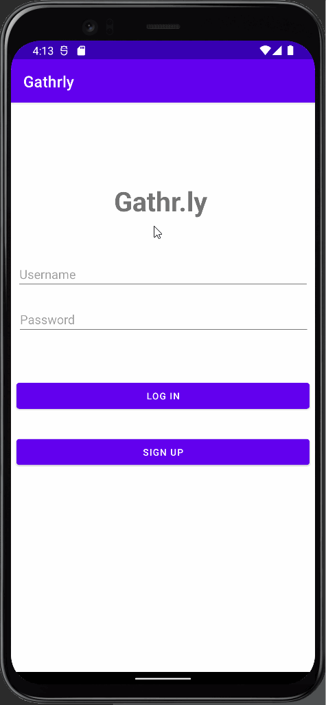

Unit 8: Group Milestone
===
# Gathr.ly

## Table of Contents
1. [Overview](#Overview)
1. [Product Spec](#Product-Spec)
1. [Wireframes](#Wireframes)

## Overview
### Description
Scheduling outing app. Users can set dates that they are available and app will find a time/day that everyone/most people are available

### App Evaluation
- **Category:** Social Networking
- **Mobile:** This app would be primarily developed for mobile but would perhaps be just as viable on a computer in the future.
- **Story:** Find the time and day that everyone/most people are available for an event.
- **Market:** Any individual could choose to use this app.
- **Habit:** This app could be used as often or unoften as the user wanted depending on event frequency.
- **Scope:** Start with only schduleing feature. May expanded to a somewhat larger scope including Chat system in the future version.

## Product Spec
### 1. User Stories (Required and Optional)

**Required Must-have Stories**

* [x] Login/Sign Up page - User logs in to app if they have an account, otherwise they will sign up for an account.
* [x] Add a friend - user can add a friend to contact list
* [x] User can add availability
* [x] User can create event
* [x] User can edit event
* [ ] User can delete event
* [x] User can view all events
* [x] User can view overlapping available times for everybody/most people
* [ ] Users in same event can chat together

**Optional Nice-to-have Stories**

* [ ] Reschedule events from a “past events” list
* [ ] Chat system for each event

### 2. Screen Archetypes

* [x] Login/Signup - User signs up or logs into their account
* [x] Friend list
    * [x] Add a friend button
    * [x] Can remove friends
    * [ ] See friend requests
* [x] Events list
   * [x] Create an event button
   * [x] See incoming event requests after tapping on a different button?
   * [x] Can edit and delete events
   * [x] Event detail screen after tapping on an event in the list
   * [ ] Can use Google Maps to add event location
   * [x] (Optional) Sorting/searching list
* [x] Profile 
   * [X] User can see profile
   * [X] User can logout    
   * [ ] User can naviage to friends list

### 3. Navigation

**Tab Navigation** (Tab to Screen)

* [x] Login/signup activity
* [x] Main Activity com.herbert.gathr_ly.fragments
    * [x] Events List as default fragment
    * [x] Friends List
* [x] Event detail activity

**Flow Navigation** (Screen to Screen)

* [x] Login Screen/Sign up screen => Event list
* [x] Create event button on event list => Create event screen 
* [x] Create event screen => Event List
* [x] Create friend button on friend list => Create friend screen
* [x] Create event => google maps screen
* [ ] Google maps screen => create event
* [x] Create event => event list

### Video Walkthrough 1

Here's a walkthrough of implemented user stories:

GIF created with [LiceCap](http://www.cockos.com/licecap/).

### Video Walkthrough 2 - Profile Walkthrough 

GIF created with [LiceCap](http://www.cockos.com/licecap/).

### Video Walkthrough 3 - Events Walkthrough 

GIF created with [LiceCap](http://www.cockos.com/licecap/).

### Video Walkthrough 4 - Full App Walkthrough 

GIF created with [LiceCap](http://www.cockos.com/licecap/).

## Wireframes
[Add picture of your hand sketched wireframes in this section]

### [BONUS] Digital Wireframes & Mockups
https://www.figma.com/file/DB5UlZbzmwbUPtzQOXUZD5/Gathr.ly

### [BONUS] Interactive Prototype

## Schema
### Events
| Property         | Type          |Description                                     |
| ---------------- | ------------- | ---------------------------------------------- |
| objectId         | Int           |unique id for each event (default field)        |
| Events Name      | String        |name of the event                               |
| Events Details   | String        |description of the event                        |
| Events Location  | String        |location of the event                           |
| Events Time      | DateTime      |when this event happens                         |
|Author            |Pointer to User|who create this event                           |
|Participations    |Pointer to User|who participate this event                      |
|createdAt	       |DateTime	     |date when post is created (default field)       |
|updatedAt	       |DateTime    	  |date when post is last updated (default field)  |
### Networking
* Home Page
   *(READ/GET) Query all events that the user involves in.
* New Event Page
   *(CREATE/POST) Create new event
* Profile
   *(READ/GET) Query logged in user object
* Friend Page
   *(READ/POST) Query friends(user object) the logged in user have
* New Friend Page
   *(CREATE/POST) Add new friend
